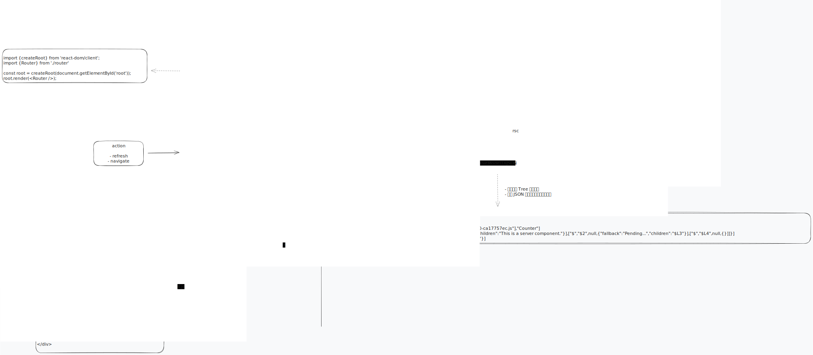

---  
tags:  
  - React  
  - FE  
  - Explanation  
aliases:  
  - 服务端组件  
share: "true"  
issue: "55"  
created: 2024-01-03T20:24  
---  
  
[React Server Component - RFC](https://github.com/reactjs/rfcs/blob/main/text/0188-server-components.md)  ｜[suspense-in-react-18](https://github.com/reactjs/rfcs/blob/main/text/0213-suspense-in-react-18.md)  
  
也许忘掉 React 相关的知识会更好理解  
  
| JSX                                                                                 | HTML                                                                                |  
| ----------------------------------------------------------------------------------- | ----------------------------------------------------------------------------------- |  
|  |  |  
  
## RFC 简单总结  
  
### 动机  
  
React 一直以来都面临两个挑战：  
  
1. 如何更容易（默认情况下）获得良好的性能  
2. 如何更轻松（快）的在 React 应用程序中获取数据  
  
一开始 React 寻找相应问题的有针对性的解决方案 (Fiber / stream SSR)，但结果都不满意。核心问题是 React 应用以客户端为主，没有充分利用服务器  
  
  
  
如果能够让开发人员更轻松的利用他们的服务器，就可以解决所有这些挑战，并提供更强大的方法来构建应用程序  
  
#### RSC 是如何解决挑战的？  
  
服务端组件：**仅在**服务端运行的组件（性能取决于服务器硬件，而不是客户端硬件）  
  
- Zero-Bundle-Size Components：服务端组件相关的（import）代码不会被下载到客户端  
- Automatic Code Splitting：根据服务端组件、客户端组件、Suspense 自动分割（lazy）代码  
- Full Access to the Backend：做所有服务器可以做的事情  
  
### 怎么区分服务端 & 客户端组件  
  
在文件中加入相应指令（最早是以文件命名区分：.server.js / .client.js）  
  
服务端：`'use server'（所有组件默认为服务端）`  
  
客户端：`'use client'`  
  
  
  
Tips：  
  
- 服务端组件可以 import 客户端组件，客户端组件不能 import 服务端组件（可以通过 props 传入）  
- 客户端组件 import 的组件都以客户端组件处理（所以不需要在每个客户端组件中都声明 'use client'，只需要在「服务 / 客户端交界处」的那个文件声明即可）  
  
  
  
### 服务端渲染 VS RSC  
  
区别只在于一个直接使用 `renderToStirng` 将组件渲染为 `HTML` 返回，由浏览器直接解析渲染  
  
一个使用 `resolveModelToJSON` 将组件渲染为可序列化传输的数据返回，由客户端的 `JS` 负责解析渲染  
  
  
  
### 整体流程  
  
  
  
首次页面加载时可以选择 SSR 模式，这与现在的 React SSR 没有什么差别，所以就直接讲 RSC 的流程了  
  
1. 首次加载页面，直接返回一个骨架 HTML（同目前的 CSR），其中会附带一个 `bootstrap.js`，用于处理客户端逻辑  
2. 客户端加载运行 `bootstrap.js` 正常使用 `React render` 渲染 `<Router />` 组件  
3. 这个组件会匹配当前的路由，并发起请求获取渲染用的数据 `RSC data`，这个请求会被加上标识（`?jsx`）以区分正常的网页路由请求  
4. 服务器接收到 `?jsx` 的请求，同样根据路由匹配到相应组件，并使用 `resolveModelToJSON` 将组件转换为 `RSC data`  
   - 其实就是 `ReactElementTree` 的可被序列化版本，目前在 JS 中的 `Tree` 虽然改一改也可以变成 JSON，但是一个是数据冗余不方便解析，一个是无法很好的流式传输  
5. 客户端发起的那个请求 `promise` 会交给 `createFromFetch`，它会流式的读取响应并通过 `use` 做渲染工作  
   - JS 中的流式 API 可以参考：[JS 实现流式打包下载](pages/FE/JS%2520%E5%AE%9E%E7%8E%B0%E6%B5%81%E5%BC%8F%E6%89%93%E5%8C%85%E4%B8%8B%E8%BD%BD.md.md)  
  
### Server Action  
  
[handle-form-submission-with-a-server-action](https://react.dev/reference/react-dom/components/form#handle-form-submission-with-a-server-action)  
  
在客户端就可以直接调用服务端的方法，本质是一个 RPC 调用  
  
> 这个 API 出来之后的调侃...  
  
|  |  |  |  
| ------------------------------------------------------------------------------------ | ------------------------------------------------------------------------------------ | ------------------------------------------------------------------------------------ |  
  
#### 稳定版  
  
|  |  |  
| ----------------------------------------------------------------------------------- | ----------------------------------------------------------------------------------- |  
  
#### 编译结果  
  
还是一个网络请求，相当于用编译器把我们本要做的事给做了  
  
所以根本不会出现那些所谓的 SQL 注入、密钥不安全之类的问题  
  
  
  
#### 工程变化  
  
  
  
## REF  
  
- [RSC From Scratch](https://github.com/reactwg/server-components/discussions/5)  
- [How do React Server Components(RSC) work internally in React?](https://jser.dev/react/2023/04/20/how-do-react-server-components-work-internally-in-react)  
- [How React server components work: an in-depth guide](https://www.plasmic.app/blog/how-react-server-components-work)  
- [server-components-demo](https://github.com/reactjs/server-components-demo)  
- [waku](https://github.com/dai-shi/waku)  
